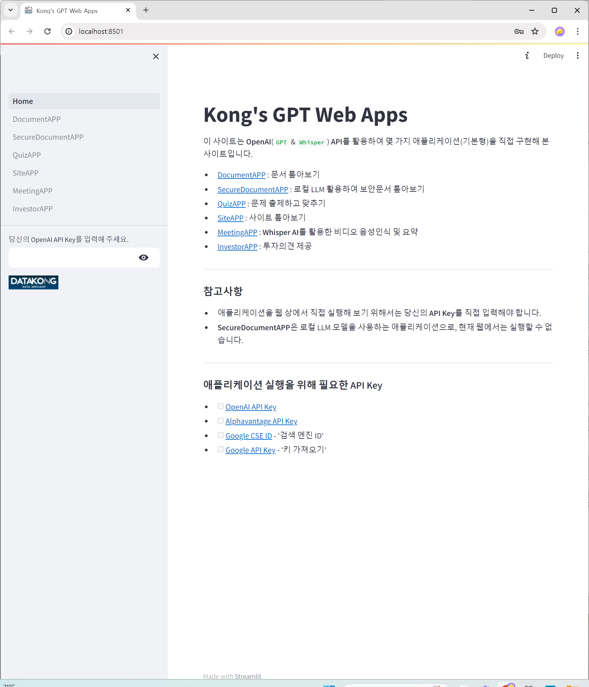

## [9th 프로젝트]: OpenAI API 활용 생성형 AI 웹 애플리케이션

- 작성: 2024년 5월 9일
- 사이트 바로가기: To be released soon 
  
  
### 프로젝트 개요

1. 주제 및 데이터 소개: **OpenAI(`GPT` & `Whisper`) API 활용 생성형 AI 웹 애플리케이션** 

    - **생성형 AI(Generative AI)**: 대화, 이야기, 이미지, 동영상, 음악 등 새로운 콘텐츠와 아이디어를 만들어 낼 수 있는 인공지능을 의미하며, 방대한 양의 데이터를 기반으로 사전 훈련된 초대형 모델인 기계 학습 모델을 사용함
      
        - **대용량 언어 모델(Large Language Model, LLM)**
            - 방대한 양의 텍스트 데이터를 학습한 인공지능 모델로, 자연어 생성, 이해, 번역 등 다양한 자연어 처리(NLP) 작업에서 뛰어난 성능을 발휘하여 가장 많이 활용되고 있는 **생성형 AI** 모델임   
            - 대표적인 대용량 언어 모델: OpenAI의 **GPT**(Generative Pre-trained Transformer) 시리즈, Google의 **Gemini**(Generalized Multimodal Intelligence Network), **BERT**(Bidirectional Encoder Representations from Transformers), Meta의 **LLaMA**(Large Language Model Meta AI) 시리즈, Mistral AI의 **Mistral** 등
        
        - **OpenAI API**(Application Programming Interface): OpenAI가 제공하는 대용량 언어 모델 API
            - API: 소프트웨어 애플리케이션끼리 서로 정보를 주고받기 위한 인터페이스 
            - OpenAI API에서 제공하는 자연어 생성 모델인 GPT나 음성 인식 모델인 Whisper 등의 API를 활용하면 생성형  AI 애플리케이션을 별도의 인공지능 모델 구축 없이 구현 가능  

    - 생성형 AI 웹 애플리케이션 구성
        - **DocumentAPP** : 문서 기반 챗봇 
        - **SecureDocumentAPP** : 로컬 LLM을 활용한 보안문서 기반 챗봇
        - **QuizAPP** : 문서 혹은 위키피디아 검색 기반 문제 출제하고 맞추기
        - **SiteAPP** : 사이트 내 텍스트 기반 질의 응답
        - **MeetingAPP** : 비디오 음성 추출 및 전사, 요약, 번역, 챗봇
        - **InvestorAPP** : 투자의견 제공 
  
  
2. 세부 구현    
  
    - **DocumentAPP**
        - 문서 파일 업로드 
        - OpenAIEmbeddings()를 활용하여 문서 임베딩 → 캐싱해서 동일 문서는 재사용  
        - FAISS 벡터스토어에 임베딩한 파일 저장 
        - ChatOpenAI()를 활용하여 챗봇 형태로 문서 내용에 대해 묻고 답하기 
            - 대화 히스토리 저장 기능 포함
        
    - **SecureDocumentAPP**
        - DocumentAPP와 동일한 로직으로 구현
        - 오픈 소스 LLM을 활용: 온라인 연결없이 사용할 수 있어 보안성 높음
            - OllamaEmbeddings(), ChatOllama() 활용
        
    - **QuizAPP**
        - 문제 출제 원천 선택: 파일 업로드 혹은 위키피디아 검색 
        - 문제 출제 형식 및 정답 체크 방식에 대한 프롬프트 체인 제공 
        - 업로드된 파일 혹은 검색된 위키피디아 내용에 근거하여 문제 출제  
        - 사용자가 정답 제출하면 정답  여부 검수 후 결과 반환 
    
    - **SiteAPP**
        - 웹사이트 주소 입력  
        - 문서 파일이 웹사이트 내 텍스트로 변경되었을 뿐, DocumentAPP와 동일한 로직으로 구현 
        - 웹사이트 내 머리글(header)과 바닥글(footer)을 제외한 본문 텍스트만을 파싱하는 단계 추가
        - 질문에 대한 복수의 답변, 답변의 정확도, 관련 텍스트를 함께 반환하도록 구현
        - 답변의 정확도가 가장 높은 답변 최종 선택   
    
    - **MeetingAPP**
        - 비디오 파일 업로드
        - 음성 추출 
        - Whisper API를 활용하여 전사 텍스트 작성 
        - 요약본 작성 
        - 요약본 한글 번역 작성
        - 전사 텍스트 기반 챗봇
          - 대화 히스토리 저장 기능 포함
    
    - **InvestorAPP**
        - 투자에 관심있는 기업명 입력 
        - Google Custom Search API를 활용하여 해당 기업의 주식시장 기호(symbol) 반환 
        - Alphavantage API를 활용하여 해당 기업의 재무 현황 개요, 손익계산서, 주식 흐름 등에 대해 종합적으로 검토 
        - 투자 의견 반환

    
3. 웹 배포   
   
    - 웹 배포: Streamlit 라이브러리 활용
    - 사이트 바로가기: To be released soon 
    - **애플리케이션 실행을 위해 필요한 API Key**     
        - [OpenAI API Key](https://platform.openai.com/account/api-keys)  
        - [Alphavantage API Key](https://www.alphavantage.co/support/#api-key)  
        - [Google CSE ID](https://programmablesearchengine.google.com/controlpanel/create) - '검색 엔진 ID'
        - [Google API Key](https://developers.google.com/custom-search/v1/introduction?hl=ko) - '키 가져오기'
            
   

    

    

    

  

